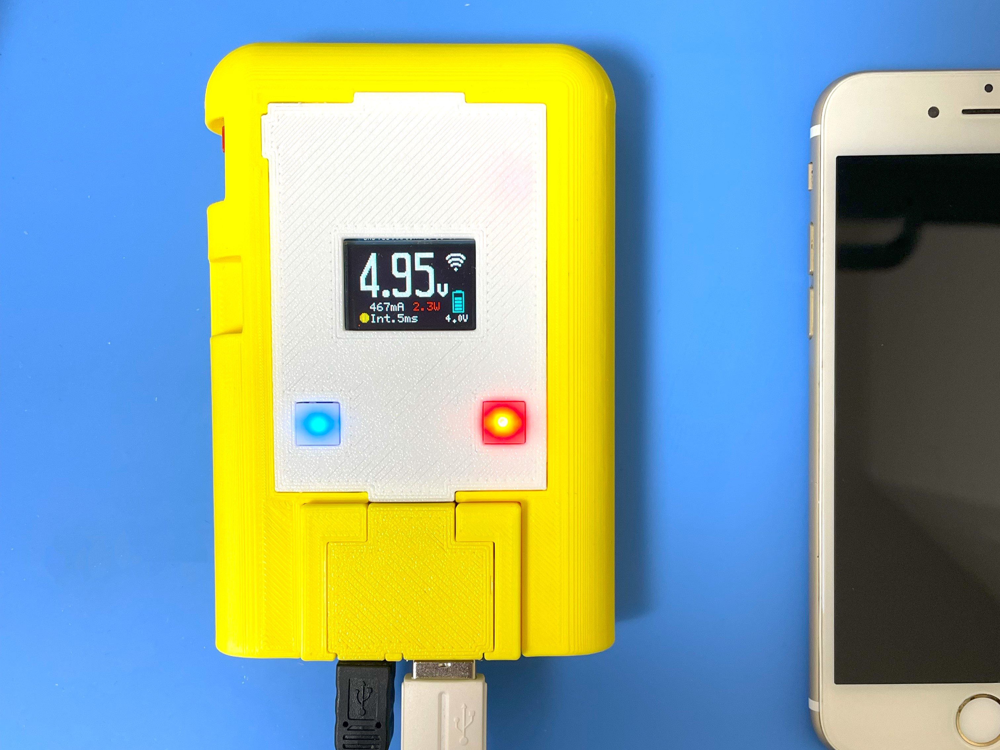
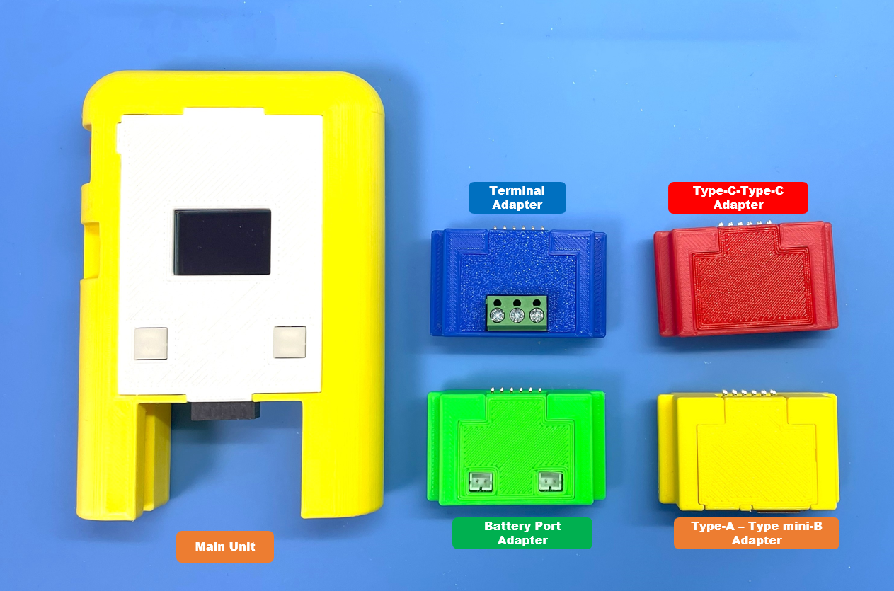
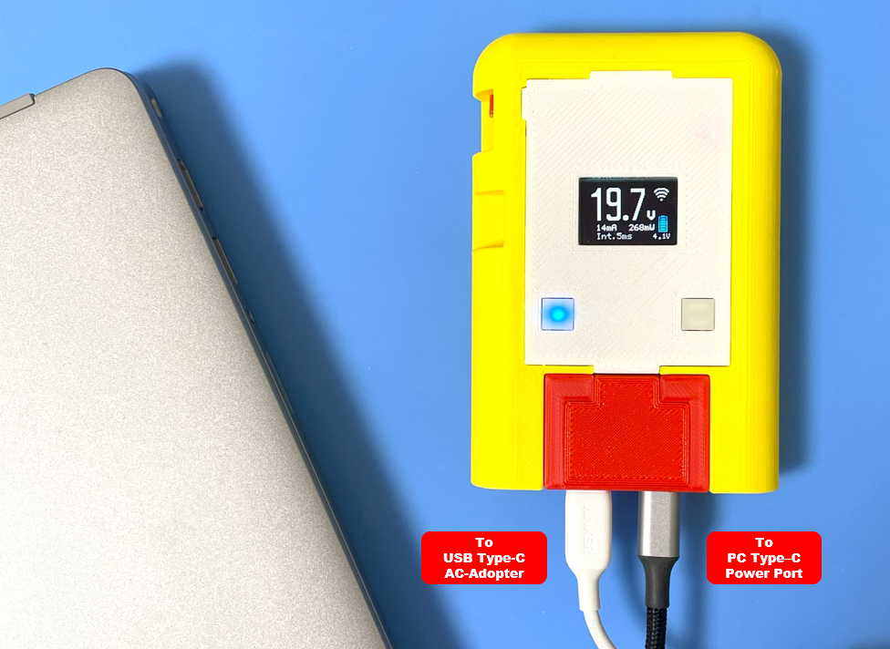
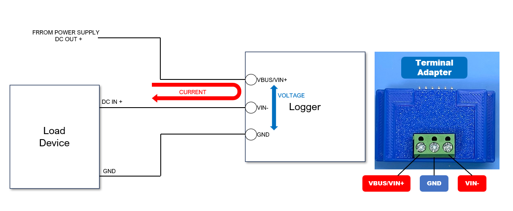
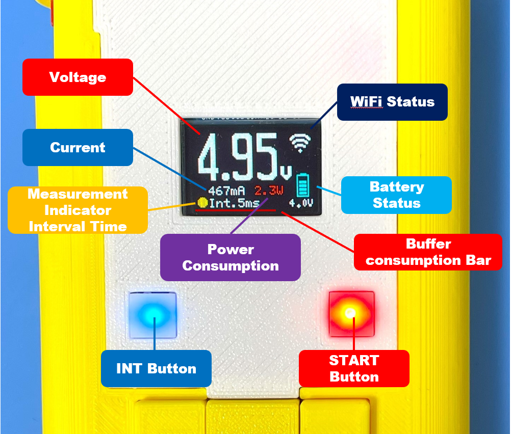
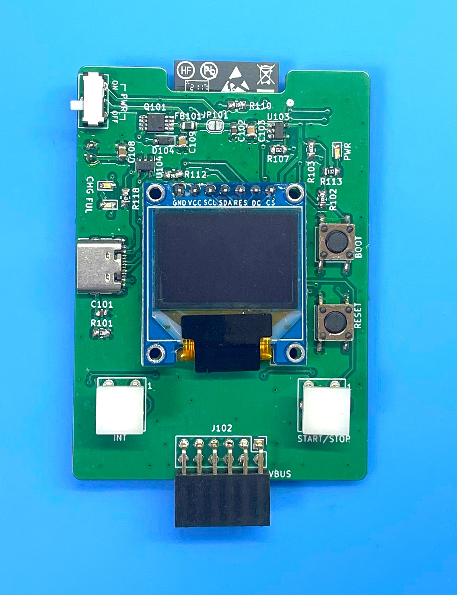
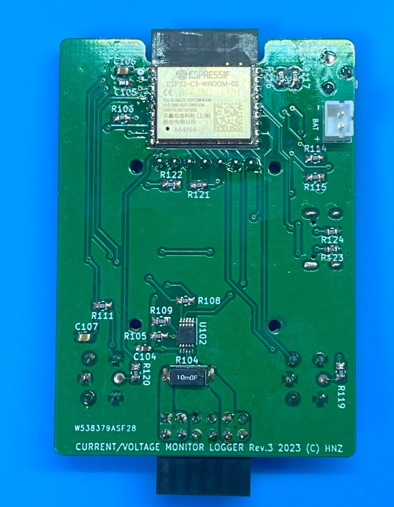
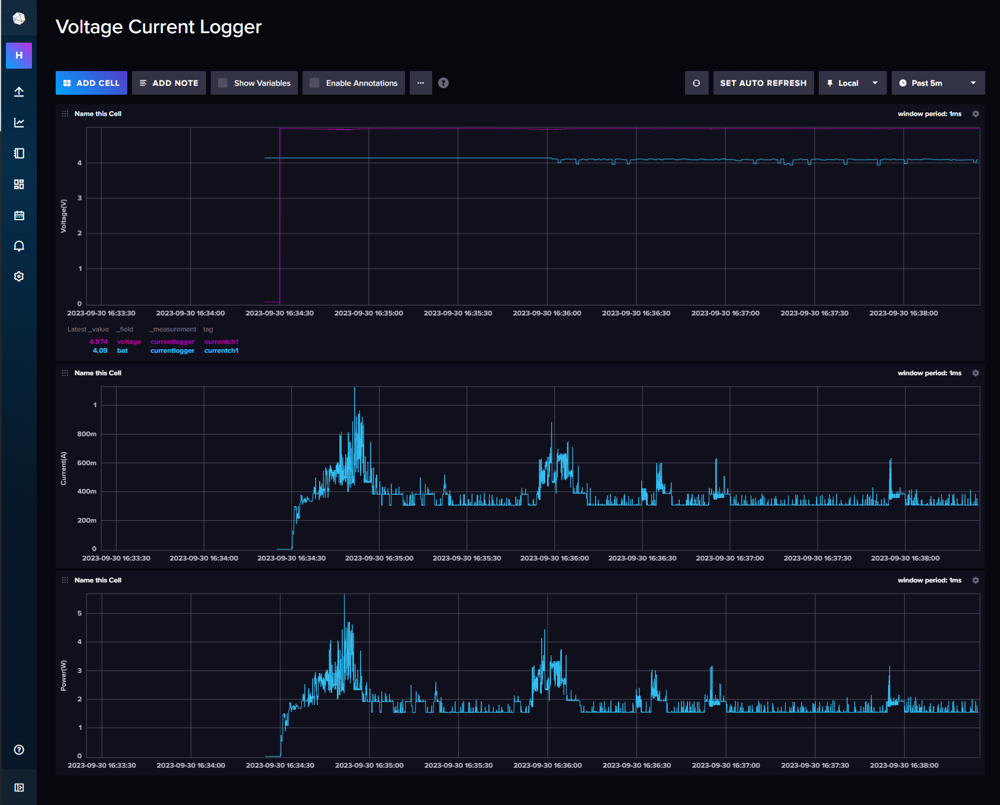

<div align="center">
  <h1><code>Voltage-Current Logger</code></h1>
  <p>
    
  </p>
</div>

# Voltage-Current Logger - High-resolution digital power monitor and logger

This tool provides a logging function that gets data on voltage, current and power consumption. Voltage input range is from 0 to 85V, Maximum current input is 15A. 

# Feature

**High-resolution** - By using Texas Instruments INA228 IC - 20-bit delta-sigma ADC, It can be got measurement data with 195.uV Bus voltage and 163.84mV Shunt voltage. 

**Microcontroller on board** - No need for a client PC when you are measuring. Directly send to the server. 

**Transfer measurement data via WiFi** - This Logger can transfer data to Linux PC via WiFi network and you can see the dashboard graph in influxDB.

**Battery Powered** - Using LiPo battery. It can run for 24-48 hours.

**Multiple Adopter** - This Logger can be changed 4 type adopters (USB-Type-C-Type-C, USB-Type-A-mini Type-B, JST-PH-Connector for Battery, 3P-Terminal)  

# How to use the Logger
This logger has four types of adapters, and by changing them, it is possible to measure the usage voltage, current, and power consumption of various devices"


* Red Adapter - To measure the voltage and current from USB Type-C Power Adapter to Type-C Power Input Device(PCs, etc.)

* Yellow Adapter - To measure the voltage and current from USB Type mini-B port to USB Type-A output port.

* Green Adapter - To measure the voltage and current between JST-PH connector. (Batteries, etc.)

* Blue Adapter - To measure the voltage and current some cabling type.

For example, if you want to measure the voltage of USB-Type-C power, set the red adopter into the slot. If the power supply does not work, you can try to insert one of the connected Type-C connections in the opposite side of the back. Because a Type-C cable has two sides.


The Blue Adapter has 3 pins screw terminal. To measure voltage and current, connect to the following the schematic. 

DO NOT CONNECT WITH OPPOSITE POLARITY. IF CONNECTED, THE ADC IC IS WILL BE DAMAGED.




The measurement interval time can be selected from 5 ms to 1 sec. When the logger is powered on, the interval time is 5 ms, then pressing the INT button will set the interval to 100 ms, or 1 sec, and so on in multiples of 10.
Push the START button, then the logger starts to send to the server voltage, current and power consumption data.



A display can show you the current voltage, current, power consumption, battery voltage, buffer consumption, and WiFi connection status.
If the WiFi Access Point cannot establish a connection, the display will not show WiFi mark. If voltage is measured while the WiFi is not connected, the data is stored in the logger's internal memory buffer. The buffer that is not being sent to the server is indicated by a red bar line on the display. When the buffer is full (the line reaches the right edge of the display), the measurement stops automatically. Then, when the WiFi is connected and transmitted to the server, the buffer line shrinks to the left. If the buffer is full and the measurement is stopped, pressing the Start button again discards the measurement data being held and starts the measurement again.





If you send data to the server, You can see the realtime data using Dashboard by [InfluxDB](https://www.influxdata.com/influxdb/).



After the measure, to stop logging, push the START button again.

To charge a battery, just connect to a USB Type-C port from the bus-powered USB port. During the charge, the CHG LED is RED ON. After the charging is full, the FUL LED is GREEN ON. And the charging will be stopped automatically. But, 

DO NOT CONTINUE THE CHARGE IF THE BATTERY IS FULL FOR A LONG TIME. 

# How to build from code and Install to the unit.

Using Ubuntu 22.04.03 LTS

1. Install Rust Compiler
```bash
$ sudo apt -y install git python3 python3-pip gcc build-essential curl pkg-config libudev-dev libtinfo5 clang libclang-dev llvm-dev udev
$ curl --proto '=https' --tlsv1.2 -sSf https://sh.rustup.rs | sh
select No.1
$ source "$HOME/.cargo/env"
```

2. Install toolchain for ESP32-C3
```bash
$ cargo install ldproxy
$ cargo install espup
$ rustup toolchain install nightly --component rust-src
$ rustup target add riscv32imc-unknown-none-elf
$ cargo install cargo-espflash
```

3. Add UDEV rules
```bash
$ sudo sh -c 'echo "SUBSYSTEMS==\"usb\", ATTRS{idVendor}==\"303a\", ATTRS{idProduct}==\"1001\", MODE=\"0666\"" > /etc/udev/rules.d/99-esp32.rules'
$ sudo udevadm control --reload-rules
$ sudo udevadm trigger
```

4. Download Current-Logger code
```bash
$ git clone https://github.com/hnz1102/current-logger.git
$ cd current-logger/src/current-logger
``` 
5. Setting WiFi SSID, Password, and InfluxDB server IP address.
```bash
src\current-logger\cfg.toml

[currentlogger]
wifi_ssid = "<your-AP-ssid>"     # Set your AP ssid.
wifi_psk = "<your-AP-Password>"  # Set password for ssid
http_server = "<PC address>:3001" # Set IP address and port. port should be 3001.
```

6. Connecting the board and Set device and set toolchain.
```bash
Connecting the current-Logger by USB to this build code PC. Then, 
$ cargo espflash board-info
select /dev/ttyACM0
Chip type:         esp32c3 (revision v0.4)
Crystal frequency: 40MHz
Flash size:        4MB
Features:          WiFi, BLE
MAC address:       xx:xx:xx:xx:xx:xx

$ rustup component add rust-src --toolchain nightly-2023-06-10-x86_64-unknown-linux-gnu
```

7. Build code and writing flash
```bash
$ cargo espflash flash --release --monitor
App/part. size:    964,240/3,145,728 bytes, 30.23%
[00:00:00] [========================================]      12/12      0x0                                                                       
[00:00:00] [========================================]       1/1       0x8000                                                                    
[00:00:11] [========================================]     546/546     0x10000                                                                   [2023-11-11T10:17:05Z INFO ] Flashing has completed!

And automaticaly boot!
```
# How to Install the influxDB and Agent

1. Download [influxDB](https://docs.influxdata.com/influxdb/v2.7/install/?t=Linux) and Install.
```bash
$ wget https://dl.influxdata.com/influxdb/releases/influxdb2-2.7.0-amd64.deb
$ sudo dpkg -i influxdb2-2.7.0-amd64.deb
$ sudo service influxdb start
```

2. Configure the influxDB

```
Connect to the 'http://<influxDB installed PC Address>:8086'
```
Click `GET STARTED` and set `Username`, `Password`, `Initial Organization Name`, and `Initial Bucket Name`
|Term|Value|
|---|---|
|Username|Set login username as influxDB administrator web console|
|Password|Set login password as influxDB administrator web console|
|Initial Organization Name| Organization Name ex. ORG|
|Initail Bucket Name| LOGGER |

After set them, click `CONTINUE`.

3. Copy the operator API token.

You can see the operator API token on the browser. YOU WON'T BE ABLE TO SEE IT AGAIN!
If you want to get new API token, click `API Tokens` menu form `Sources` Icon, then click `GENERATE API TOKEN` and select `All access token`, click `Save`.
You can see a new API token and get it.
After copy the token, click `CONFIGURE LATER`.

4. Import the Dashboard Template.

Click the `Dashboard` icon, and select `Import Dashboard` from the `CREATE DASHBOARD` menu.

Drop the `src/server/voltage_current_logger.json` file to `Drop a file here`, then click `IMPORT JSON AS DASHBOARD`.

You can see the `Voltage Current Logger Dashboard` pannel on the Dashboards page.

Click this panel, and You can see the Voltage-Current-Logger Dashboard.

If you want to customize the dashboard design, click configure mark. You can change the graph design.

5. Install the Agent.

Current-Logger can't directly send data to influxDB API since ESP32-C3 has not TSL software stack. This agent program is responsible for changing HTTP communication from Current-Logger to HTTPS communication and passing data to the InfluxDB API. This agent is purpose only for a local network because it has no security.

Before install you have to change parameters in main.js.

src/server/main.js
```javascript
const token = "<influxDB API Access Token>"
const url = 'http://<influxDB installed IP address>:8086'
let org = `<YOUR ORGANIZATION NAME: it has to be same the Initial Organization Name>`
let bucket = `LOGGER`
```

Install the agent program.

```bash
$ sudo apt install nodejs npm
$ cd src/server/
$ ./install.sh
```
If it is `Active: active` as shown below, it has started normally.
```
● influxdb-agent-current.service - InfluxDB Agent for Currentlogger
     Loaded: loaded (/lib/systemd/system/influxdb-agent-current.service; enabled; vendor preset: enabled)
     Active: active (running) since Sat 2023-11-11 11:36:02 UTC; 12ms ago
    Process: 6883 ExecStart=/var/lib/currentlogger/influxdb-agent-start.sh (code=exited, status=0/SUCCESS)
   Main PID: 6884 (node)
      Tasks: 1 (limit: 19009)
     Memory: 1.5M
        CPU: 10ms
     CGroup: /system.slice/influxdb-agent-current.service
             └─6884 /usr/bin/node /var/lib/currentlogger/main.js
```

6. Start Current-Logger Logging and Send Data.

Push the START button. Logging data will be sent to the influxDB. You can see the data on the dashboard.

## LICENSE
This source code is licensed under MIT. Other Hardware Schematic documents are licensed under CC-BY-SA V4.0.
